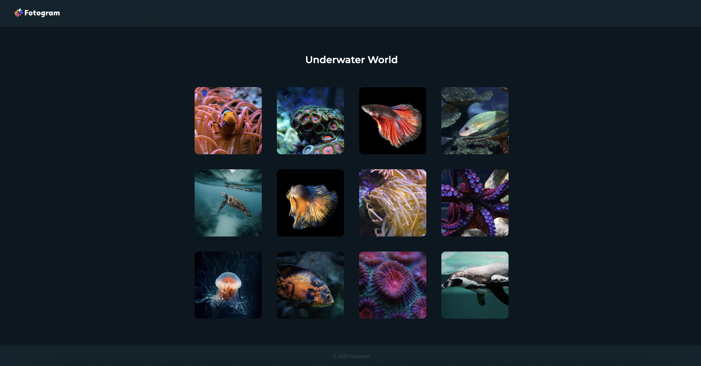
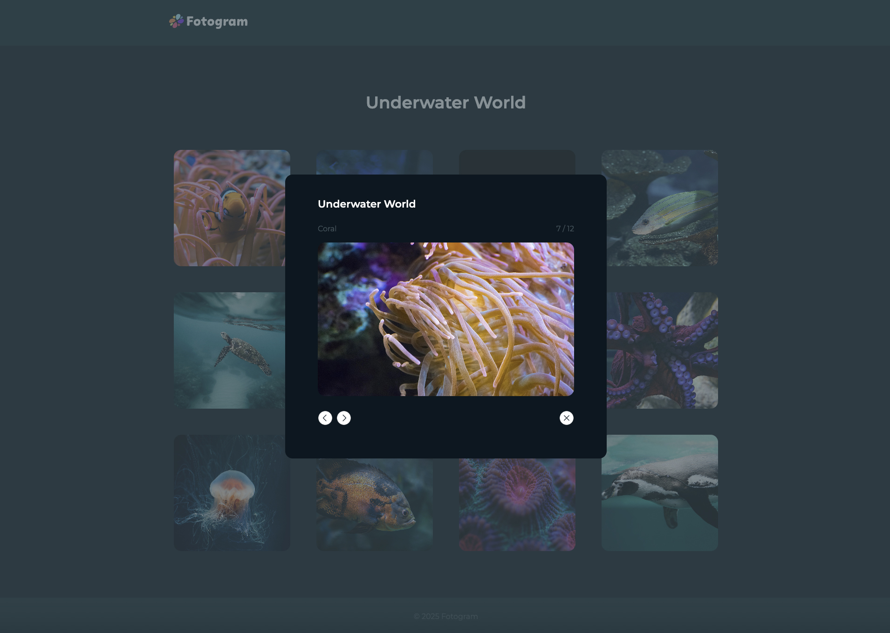

# Fotogram

A web application for displaying photos. Images are rendered dynamically via JavaScript and can be viewed in an enlarged pop-up window.

Fotogram is part of the Developer Akademie's training programme for software developers ([www.developerakademie.com](https://www.developerakademie.com)). Certain technical and logical requirements had to be met for this project, but I was able to incorporate my own ideas into the design. The logo used was provided by the Developer Akademie. All other images are from Pixabay.





## Table of Contents

- [Prerequisites](#prerequisites)
- [Quickstart](#quickstart)
- [Project Structure](#project-structure)

## Prerequisites

No build tool or server required — just a modern browser.

## Quickstart

Clone the repository:

```bash 
git clone https://github.com/karinaklages/fotogram.git
cd fotogram
```

Then open `index.html` directly in your browser:

```text
fotogram/index.html
```

## Project Structure

```text
fotogram/
├── fonts/           # Local font files
├── img/             # Images and assets
├── index.html       # Application entry point
├── style.css        # Main stylesheet
├── mobile.css       # Responsive styles for mobile devices
├── fonts.css        # Font definitions
├── script.js        # Core logic
└── template.js      # HTML templates for dynamic content
```