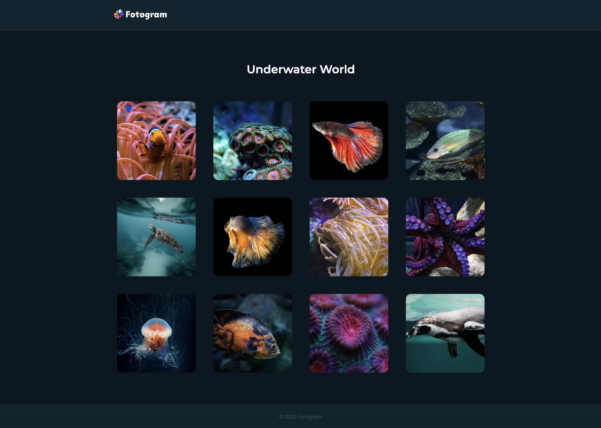

<h1 align="left">Fotogram</h1>

###

Fotogram is a platform for displaying pictures. All images are rendered using JavaScript and the platform also features a dialog pop-up window.   

This project is part of the Developer Academy's software developer training program to learn more about JavaScript. The logo used was provided by the Developer Academy. All other images are from Pixabay.

 

###

